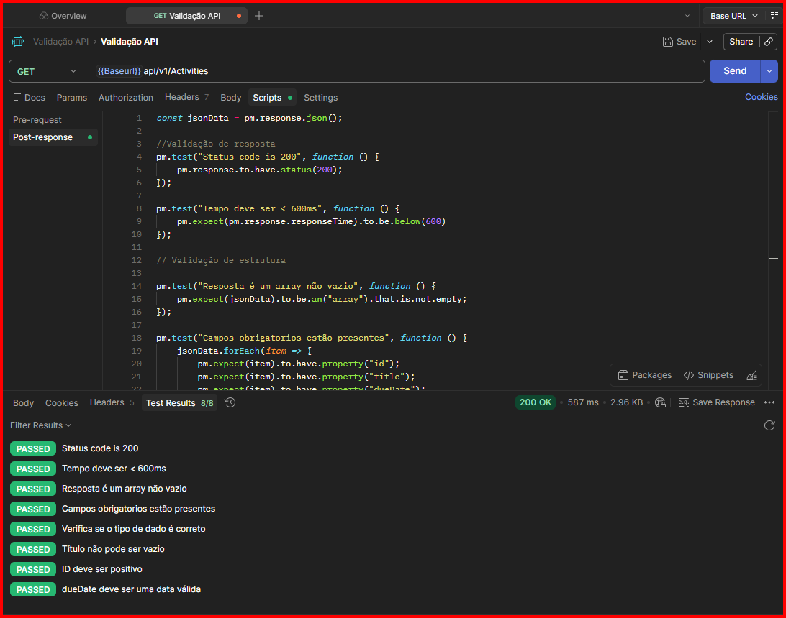

#  Teste-Fake-REST-API

---

## Objetivo
Garantir a integridade, estrutura e regras de negócio da API de listagem de tarefas, validando que os dados retornados estejam corretos, consistentes e dentro das expectativas do negócio.

---

## Testes realizados
- Status da resposta e tempo de retorno
- Estrutura e tipagem dos campos retornados
- Regras de negócio e validação de valores

---

## API usada
[Fake REST API](https://fakerestapi.azurewebsites.net/index.html)

---

## Ferramentas utilizadas
- Postman – Execução de testes de API
- JavaScript – Scripts de validação no Postman
- GitHub – Versionamento e organização do portfólio

---

## Passo a Passo
- Clonar o projeto
- Importar os arquivos "Base URL.postman_environment.json" e "Validação API.postman_collection.json"

---

## Validações Implementadas
- Validação de Resposta
- Status code deve ser 200
- Tempo de resposta menor que 500ms
- Retorno deve ser um array não vazio

---

## Validação de Estrutura

Validação do objeto da resposta se o mesmo esta no formato de array, conforme estrutura abaixo:

```json
[
  {
    "id": 0,
    "title": "string",
    "dueDate": "2026-03-24T18:25:26.949Z",
    "completed": true
  }
]

```

---

## Tipos de dados

Valida

| Campo     | Tipo esperado |
|-----------|---------------|
| id        |    number     |
| title     |    string     |
| dueDate   |    string     |
| completed |    boolean    |

---

## Regras de negócio
- title não pode ficar vazio
- id precisa ser positivo
- dueDate tem que ser uma data válida
- completed deve ser boolean
  
---

## Como os testes funcionam
- Validação do status code e tempo de resposta
- Validação da estrutura e tipos dos campos
- Validação das regras de negócio

Todos os testes foram executados no Postman e passaram com sucesso, garantindo que a API atende às expectativas do negócio.

